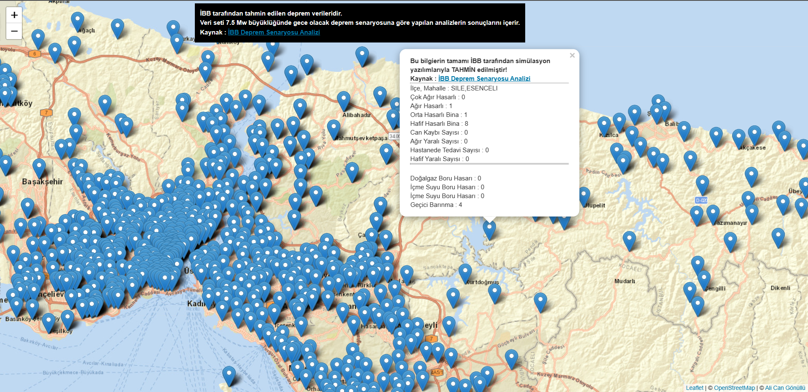

İBB İstanbul Depremi Tahmini (2021, Haritalandırılmış)

<b>İBB tarafından tahmin edilen deprem verileridir.
 Veri seti 7.5 Mw büyüklüğünde gece olacak deprem senaryosuna göre yapılan analizlerin sonuçlarını içerir.
 Kaynak : <a target='_blank' href='https://data.ibb.gov.tr/dataset/deprem-senaryosu-analiz-sonuclari/resource/9c3ac492-de4b-4245-b418-7ad3df67a193'>İBB Deprem Senaryosu Analizi</a>
 
NOT : Çok fazla data olduğu için harita kasabilir.

<a href="https://alicangnll.github.io/ibb-istanbul-depremi-tahmini-2021">İstanbul Tahmini Deprem Haritası</a>

